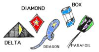
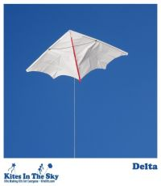
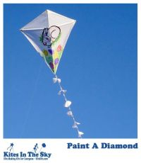
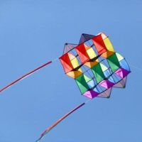
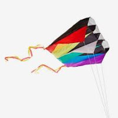

# 05 Where to fly my kite?

Recently I bought kite. Instead waiting for best weather in Poland, lets use weather prediction service and filter out locations which match my requirements.
We will go through whole process building this filter service using TDD approach.

## Code

* [Weather](src//main//java//io//github//javafaktura//s01e05//weather//Weather.java) - weather prediction containing basic information about weather, location and date.
### Predition module
* [WeatherPredictor](src//main//java//io//github//javafaktura//s01e05//weather//prediction//WeatherPredictor.java) - weather prediction API which allows to consume Weather predictions for X upcoming days from given starting date.
* [RandomWeatherPredictor](src//main//java//io//github//javafaktura//s01e05//weather//prediction//RandomWeatherPredictor.java) - Dumb implementation generating random values for provided locations.
### Location module -
* [Location](src//main//java//io//github//javafaktura//s01e05//weather//location//Location.java) - Class representing location as two String values: city and country.
* [LocationProvider](src//main//java//io//github//javafaktura//s01e05//weather//location//LocationProvider.java) - API allowing to provide list of Locations.
* [LocationFileProvider](src//main//java//io//github//javafaktura//s01e05//weather//location//LocationFileProvider.java) - Implementation of above API based on csv files.
### Filter module
* [WeatherCriteria](src//main//java//io//github//javafaktura//s01e05//weather//filter//WeatherCriteria.java) - allows to define all weather attributes required for filtering
* [WeatherLocationFilter](src//main//java//io//github//javafaktura//s01e05//weather//filter//WeatherLocationFilter.java) - filter allowing to limit provided source of weather predictions fulfilling given WeatherCriteria

## Requirements
* As User of WeatherLocationFilter I want be able to:
    * filter Weathers where temp is higher than minimal temp defined in WeatherCriteria
    * filter Weathers where temp is lower than maximal temp defined in WeatherCriteria
    * filter Weathers for three defined rain conditions:
        * WET (for any Weather predicting rainfall),
        * DRY (for any Weather predicting rainfall = 0.00 mm/day),
        * WHO_CARES (default value for any rain conditions)
    * provide easy way to convert following kite requirement types to WeatherCriteria:

        
        * DELTA - allowing to fly for Wind from 9.66 km/h to 24.14 km/h

            
        * DIAMOND - allowing to fly for Wind from 9.66 km/h to 24.14 km/h

            
        * DRAGON - allowing to fly for Wind from 9.66 km/h to 24.14 km/h

            
        * BOX - allowing to fly for Wind from 12.87 km/h to 40.23 km/h

            
        * STICKLESS_PARAFOIL - allowing to fly for Wind from 12.87 km/h to 40.23 km/h

            
    * allow to define days in a row in WeatherCriteria, so only results fulfilling this will be filtered out

## TDD - step by step

Inside `io.github.javafaktura.s01e05.weather.filter.tdd` we defined 11 steps of implementing above requirements using TDD approach.

| Step        | Phase           | Comments  |
| ------------- |:-------------:| -----:|
| [Step 1](src//test//java//io//github//javafaktura//s01e05//filter//tdd//step1//WeatherLocationFilterTest.java)        | :closed_book: | First test introduced, we expect to return whole list for empty criteria object      |
| [Step 2](src//test//java//io//github//javafaktura//s01e05//filter//tdd//step2//WeatherLocationFilterTest.java)        | :green_book:  | Providing minimal implementation allowing to pass first test |
| [Step 3](src//test//java//io//github//javafaktura//s01e05//filter//tdd//step3//WeatherLocationFilterTest.java)        | :closed_book: | Second test introduced, we expect to return limited list for minimal temp criteria defined |
| [Step 4](src//test//java//io//github//javafaktura//s01e05//filter//tdd//step4//WeatherLocationFilterTest.java)        | :closed_book: | Trying to provide minimal implementation to pass second test and it pass, but we introduce regression to first test. |
| [Step 5](src//test//java//io//github//javafaktura//s01e05//filter//tdd//step5//WeatherLocationFilterTest.java)        | :green_book: :arrow_down: :blue_book:| Refactoring WeatherCriteria so both tests pass      |
| [Step 6](src//test//java//io//github//javafaktura//s01e05//filter//tdd//step6//WeatherLocationFilterTest.java)        | :closed_book: | Third test introduced, now we expect to return only weather withing defined temp range |
| [Step 7](src//test//java//io//github//javafaktura//s01e05//filter//tdd//step7//WeatherLocationFilterTest.java)        | :green_book: | Implementation to pass this one is very similar to earlier. All tests passes!|
| [Step 8](src//test//java//io//github//javafaktura//s01e05//filter//tdd//step8//WeatherLocationFilterTest.java)        | :closed_book: | 4th test introduced, this time we implement rain conditions and define test covering this new requirement|
| [Step 9](src//test//java//io//github//javafaktura//s01e05//filter//tdd//step9//WeatherLocationFilterTest.java)        | :green_book: | Minimal implementation to pass 4th test introduced|
| [Step 10](src//test//java//io//github//javafaktura//s01e05//filter//tdd//step10//WeatherLocationFilterTest.java)        | :closed_book: | Kite requirements seems to be a little bit more complicated, so we decide to define parametrized test covering all edge cases. 5 new tests which currently fails providen. |
| [Step 11](src//test//java//io//github//javafaktura//s01e05//filter//tdd//step11//WeatherLocationFilterTest.java)        | :green_book: :arrow_down: :blue_book: | Providing required implementation to pass kite tests and then starting refactoring whole filter module. Using DDD approach and moving Predicate objects to Criteria|

:closed_book: - fail
:green_book: - pass
:blue_book: - refactor
